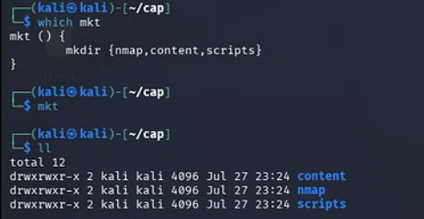
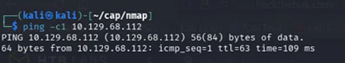
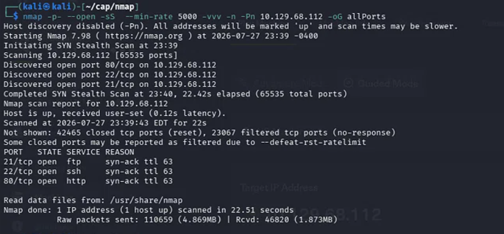
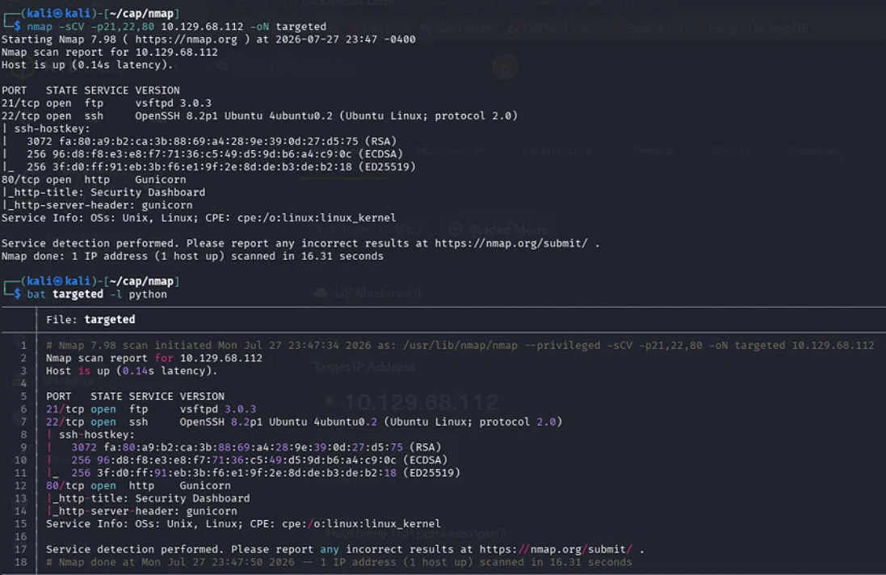
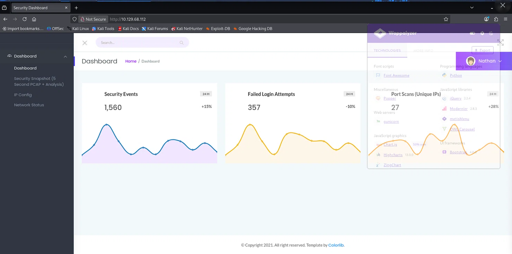
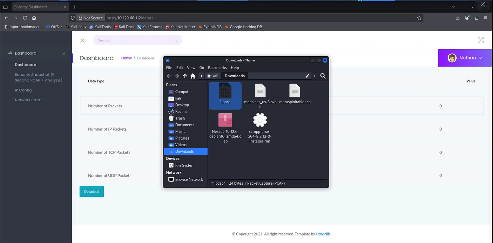
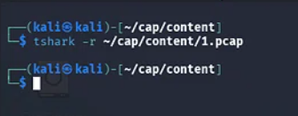
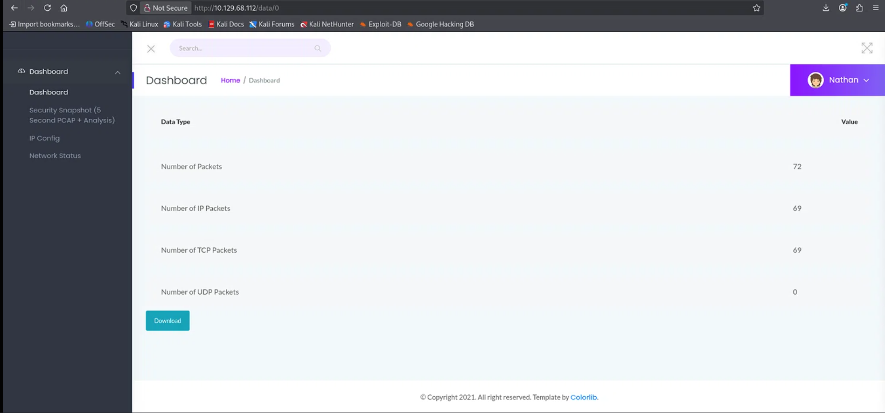
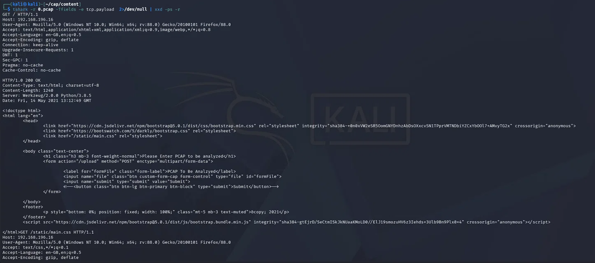

# 👑 Cap - HackTheBox Machine Walkthrough

**Target:** 10.129.68.112 | **OS:** Linux | **Difficulty:** Easy  
**Auditor:** Juan Felipe Serna | **Date:** 2026-07-28

---

## 📌 Executive Summary

This security audit of the HTB machine "Cap" successfully identified and exploited a critical chain of vulnerabilities:

1. **IDOR (Insecure Direct Object Reference)** in the web application's packet capture download endpoint allowed unauthorized access to live network traffic.
2. **Credential Harvesting** from the captured PCAP file revealed plaintext FTP credentials (`nathan:Buck3tH4TF0RM3!`), leading to initial access.
3. **Linux Capabilities Misconfiguration** (`cap_setuid+ep` on Python 3.8) enabled privilege escalation to root.

**Flags Obtained:**
- **User:** `1caba3a8441c940f425925de1550a266`
- **Root:** `05e335171411e72ea02cbed2e5686331`

**Impact:** Full system compromise from a low-privileged user to root.

**Recommendations:**
- Replace sequential IDs with UUIDs and enforce server-side session validation.
- Disable FTP in favor of SFTP/FTPS.
- Remove the `cap_setuid+ep` capability from Python (`setcap -r /usr/bin/python3.8`).

---

## 🧭 Attack Path Summary
Reconnaissance (Nmap)
↓
Web Enumeration (IDOR in /data/ & /download/)
↓
PCAP Download (ID 0 → live capture)
↓
Credential Extraction (FTP plaintext: nathan:Buck3tH4TF0RM3!)
↓
FTP Access → user.txt
↓
SSH Access (as nathan)
↓
Linux Capabilities Enumeration (python3.8 = cap_setuid+ep)
↓
Python Exploit (os.setuid(0)) → Root Shell
↓
Root Flag Captured

---

## 🔍 Phase-by-Phase Breakdown

### Phase 1: Reconnaissance & Environment Setup

Professional operational hygiene requires a dedicated, structured workspace before interacting with any target infrastructure. To initiate the audit, the root project directory was generated on the attacking machine, and navigation commands were executed to establish our local base of operations.


*Figure 1: Initial creation of the target machine project root directory and workspace navigation.*

Following the setup of the primary project folder, a specialized Bash function named `mkt` was executed to automatically deploy the internal directory architecture. This maps out dedicated storage spaces for isolated network scans (`nmap/`), looted target assets (`content/`), and development scripts (`scripts/`).



*Figure 2: Custom mkt function definition and automated workspace architecture setup.*

Once inside the dedicated scanning environment, an ICMP echo request (`ping`) was issued to verify network connectivity with the target host and perform initial operating system fingerprinting via TTL analysis.



*Figure 3: Active host verification and network response analysis.*

The target host successfully responded to the request. The network packet analysis revealed a **TTL (Time to Live) of 63**, which is heavily consistent with a **Linux** kernel system (default TTL 64), narrowing down our upcoming enumeration vectors.

### Port Discovery Scan

To discover all operational services on the target infrastructure, a full TCP port discovery scan (`-p-`) was executed utilizing a SYN Stealth Scan (`-sS`). The rate was limited to a minimum of 5000 packets per second to optimize scanning speed while preserving network stability. The output was directed into a greppable format (`-oG allPorts`) for historical record tracking.



*Figure 4: Full TCP port discovery scan output detailing open ports.*

### Service Version & Script Enumeration

Following the initial discovery, a targeted service enumeration scan (`-sCV`) was conducted specifically on the open ports (21, 22, and 80). This assessment aims to determine software versioning, identifying potential vulnerabilities or misconfigurations, and validating underlying operating system details. The findings were exported in an Nmap format (`-oN targeted`) for internal audit review.



*Figure 5: Targeted service version scanning and script execution details.*

The aggressive enumeration script provided definitive context regarding the target's attack surface:
* **Port 21 (FTP):** Running `vsftpd 3.0.3`.
* **Port 22 (SSH):** Running `OpenSSH 8.2p1` hosted on an Ubuntu Linux distribution.
* **Port 80 (HTTP):** Running a Python-based web server application managed by `Gunicorn`, explicitly exposing a web panel titled *"Security Dashboard"*.

---

### Phase 2: Exploitation & Insecure Direct Object References (IDOR)

#### Web Application Enumeration
Navigating to the operational HTTP service on port 80 (`http://10.129.68.112`) grants unauthenticated access to a customized administrative panel titled *"Security Dashboard"*. To systematically map the web application's infrastructure and components, passive fingerprinting was performed using the *Wappalyzer* extension.



*Figure 6: Administrative web interface analysis and technology stack detection via Wappalyzer.*

The technological analysis confirmed that the platform backend is powered by **Python**, running on top of a **Gunicorn** web server. The dashboard provides statistical visualizations tracking network metrics, port scans, and failed login events, explicitly operating under the active session profile of a local user named **Nathan**.

#### IDOR Data Analysis & PCAP Harvesting
When navigating through the security snapshots panel, newly generated indices (such as `/data/3`) displayed a total of zero captured network packets. This indicated that no data transactions had been recorded during those specific administrative windows. To identify an actionable attack vector, sequential data harvesting was performed by systematically manipulating the numeric parameter downwards in the web browser's URL bar.



*Figure 7: Exploitation of the IDOR vulnerability by forcing lower index parameters (`/data/1`) to exfiltrate administrative network capture history.*

Upon lowering the index parameter to `/data/1`, the backend structure processed the request without any session authorization checks and exposed a valid, historical network capture payload showing active transactions. The unauthenticated request successfully exfiltrated a **`1.pcap`** packet transaction history log. The file was downloaded locally using the *Thunar* environment manager on the attacking system, paving the way for cleartext credential analysis.

#### Network Traffic Analysis & Pivoting Strategy
The exfiltrated packet file `1.pcap` was relocated to the dedicated `content/` workspace for technical inspection. Initial packet extraction was attempted by executing a packet reading command via `tshark`:

```bash
tshark -r ~/cap/content/1.pcap
```



*Figure 8: Evaluation of the 1.pcap file via Tshark revealing zero network transactions.*

The execution returned a completely blank output. This metadata inspection confirmed that while the index allocation existed on the web server, the snapshot recorded **0 packets** of active traffic during that log capture interval. Recognizing this data limitation, a parameter pivoting strategy was applied to expand the audit scope. By manipulating the index boundary down to the initial entry (`/data/0`), a secondary file named **`0.pcap`** was successfully exfiltrated.

#### Exploiting IDOR to Target Entry 0
Upon forcing the index parameter down to `0` (`http://10.129.68`), the Security Dashboard successfully updated its interface, rendering critical log data metrics. The object mapping disclosed a total metadata population of **72 captured network packets**.



*Figure 9: Dashboard tracking data updates upon exploiting index 0, displaying 72 populated packet records.*

#### Local Workspace Consolidation
To maintain a strict and cohesive testing workflow, exfiltrated files must be moved out of generic system directories. The downloaded storage container was consolidated by transferring it from the main host download directory into the dedicated local repository subfolder (`~/cap/content/`) utilizing the native `mv` command.

```bash
mv /home/kali/Downloads/0.pcap .

This data concentration validated that a historical session capture had been successfully intercepted. Clicking the administrative interactive item **"Download"** exfiltrated the raw data payload.


*Figure 10: Verification of the downloaded 0.pcap data container within the attacking local environment.*

#### Local Workspace Consolidation
To maintain a strict and cohesive testing workflow, exfiltrated files must be moved out of generic system directories. The downloaded storage container was consolidated by transferring it from the main host download directory into the dedicated local repository subfolder (`~/cap/content/`) utilizing the native `mv` command.

```bash
mv /home/kali/Downloads/0.pcap .
```


*Figure 11: File relocation via the mv command to consolidate target resources within the operational workspace.*

#### Advanced Raw Packet Stream Inspection (Sequence 1)
To reconstruct the raw packet communications cached within the `0.pcap` trace file without using heavy GUI network analysis tools, an advanced data pipeline was assembled in the terminal. The binary payloads of the TCP transport layer streams were extracted dynamically using `tshark`, muted for network descriptor noise, and piped directly into `xxd` running reverse plaintext hex stream parsing modes (`xxd -ps -r`).

```bash
tshark -r 0.pcap -Tfields -e tcp.payload 2>/dev/null | xxd -ps -r
```



=======
---

## 📚 Lessons Learned

This assessment reinforces several key offensive and defensive security concepts that are frequently encountered during real-world penetration tests:

- **IDOR (Insecure Direct Object Reference)** is a subtle but highly critical vulnerability capable of exposing sensitive internal resources when proper authorization checks are absent.
- **Network traffic analysis**, even using simple utilities such as `strings`, `tshark`, or Wireshark's **Follow TCP Stream**, represents a powerful post-exploitation technique for recovering plaintext credentials and other sensitive information from captured traffic.
- **Linux Capabilities** provide a fine-grained privilege delegation mechanism intended to reduce reliance on SUID binaries. However, when misconfigured—such as assigning `cap_setuid+ep` to the Python interpreter—they effectively grant full privilege escalation and become just as dangerous as traditional SUID executables.
- **Defense in depth** requires much more than patching vulnerable applications. Organizations should continuously audit system capabilities, file permissions, exposed services, and authentication mechanisms to minimize the impact of configuration mistakes.

---

## 🏁 Conclusion

The **HackTheBox Cap** machine provides an excellent demonstration of how a seemingly simple web application vulnerability can escalate into a complete system compromise.

The attack chain followed a clear progression:

1. Exploit an **IDOR** vulnerability to access unauthorized packet capture files.
2. Recover plaintext FTP credentials from the captured network traffic.
3. Obtain initial access through the exposed FTP service.
4. Reuse the recovered credentials to establish an SSH session.
5. Enumerate Linux capabilities and identify an unsafe `cap_setuid+ep` assignment on the Python interpreter.
6. Abuse the capability to obtain a root shell and fully compromise the target system.

This walkthrough highlights the importance of secure application development, proper authorization controls, encrypted network communications, and continuous operating system hardening. Even a single overlooked misconfiguration can create an attack path that allows an external attacker to progress from unauthenticated access to complete administrative control.

---

**Writeup prepared for the HackTheBox "Cap" machine by Juan Felipe Serna Villada.**

*All commands, techniques, and captured flags are documented exclusively for educational purposes and authorized security training environments.*


